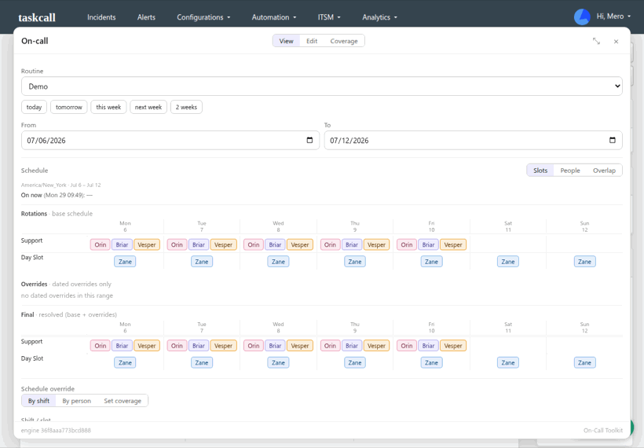
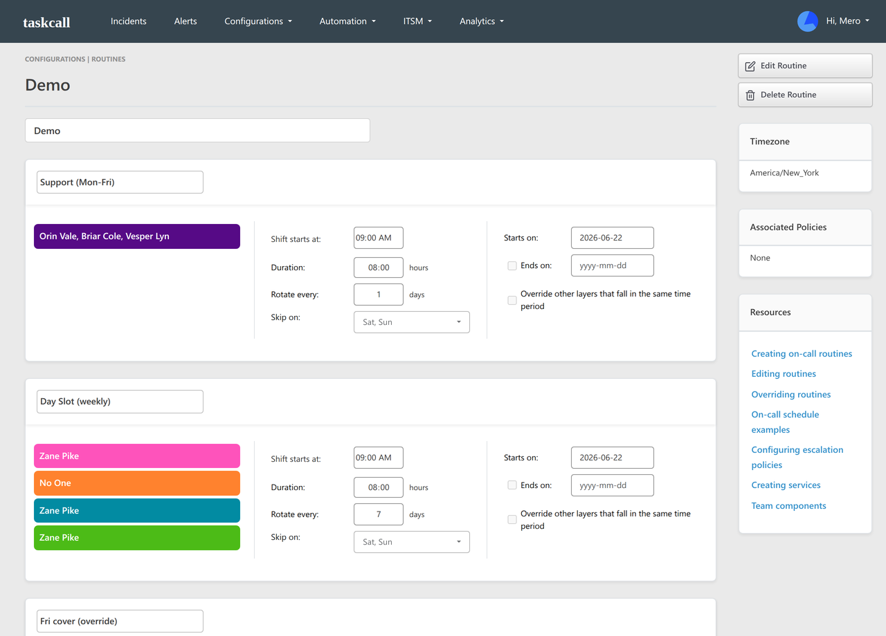
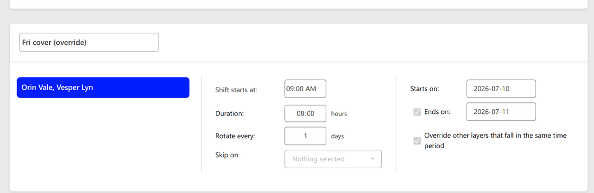
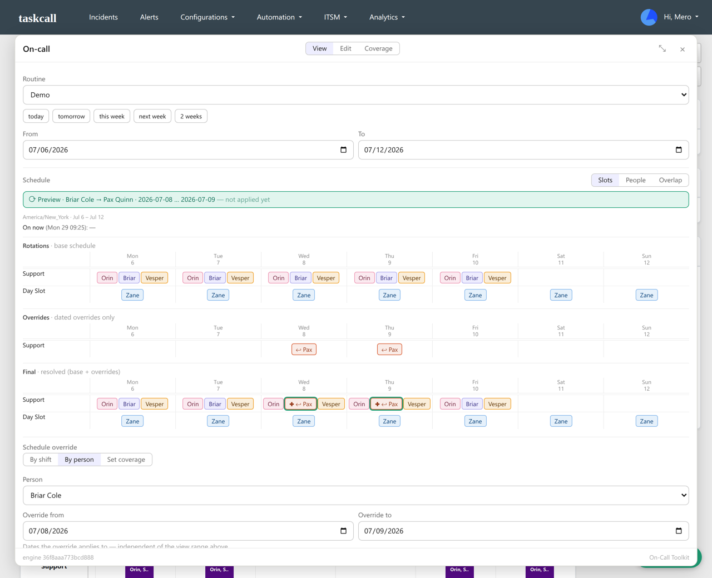
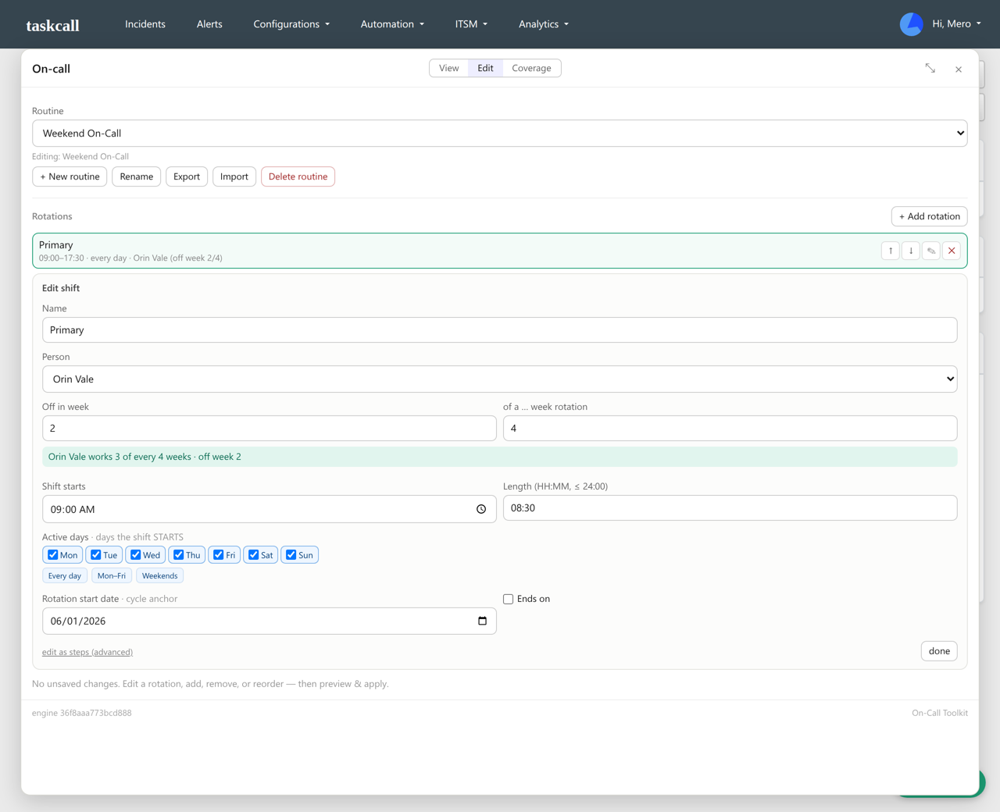
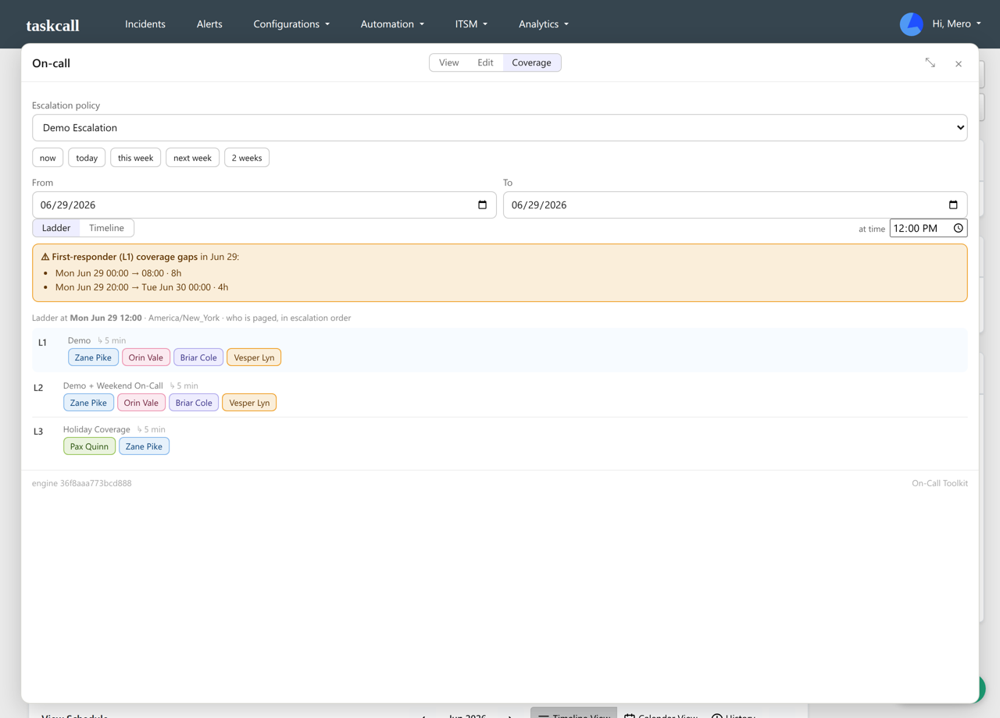
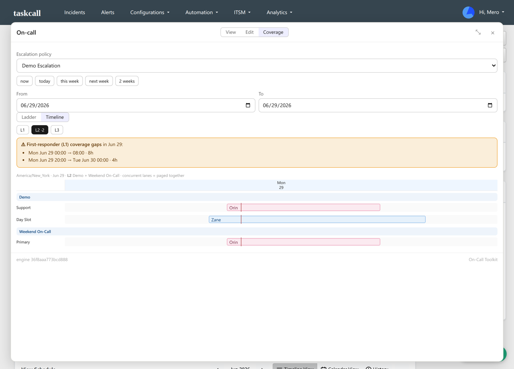

# On-Call Toolkit for TaskCall

This adds a few things to TaskCall on-call that the built-in workflow doesn't cover: swapping one person out of a shift without rewriting the whole roster, time-off covers that undo themselves, and one view of who actually gets paged across an escalation policy. It runs in your own browser tab, no server involved.

**[Install from the Chrome Web Store](https://chromewebstore.google.com/detail/bibgheadcjeghnbanemkncihombcmmdj)** — one click. Or load it unpacked (see [Installation](#installation)).



> Independent third-party tool, not affiliated with or endorsed by TaskCall. "TaskCall" is a trademark of its owner. It runs entirely inside your own logged-in TaskCall session: no server, no stored credentials, nothing leaves TaskCall.

## Why

TaskCall lets you build on-call routines and apply overrides, but its overrides are *blanket*: one layer replaces everyone who's on during the window. So there's no quick way to swap a single person and leave the rest of the shift on, creating an override means re-typing the whole window's roster by hand with no preview of the result, and there's no single view of who's actually paged across an escalation policy.

An override is a dated layer on your existing routine: it covers the dates you give it, then expires. You don't spin up a separate routine when someone's out, and the routine itself stays untouched. (A second routine is only for a genuinely different recurring rotation, like a separate weekend schedule.)

Here's the day-to-day difference:

| Task | In TaskCall today | With this tool |
|---|---|---|
| Swap one person on a multi-person shift for a few days | The override is blanket, so it replaces *everyone* on that shift. You re-type the whole roster minus the one person, with no preview, and anyone you forget silently drops off. | Pick the person, their stand-in, and the dates. A dry-run preview shows the full resulting roster with only that person changed. |
| "Works 3 of every 4 weeks" rotation | Build a four-step weekly rotation and drop a "No One" blank week in by hand, then line up the cadence and skip-days. | One line: this person, off in week N. |
| See who actually pages across a policy | No single view. You open each routine and work out by hand how the levels stack up. | Pick the policy and the whole ladder resolves, with multi-routine levels unioned and any first-responder gaps flagged. |

> **New to TaskCall? Start here.** [Covering a holiday](docs/holiday-coverage.md) walks through one ordinary chore with before/after screenshots: arranging coverage for a day when two people are off, across two back-to-back shifts (one of them overnight). Native TaskCall vs. this tool.

Here's that left-hand column in native TaskCall. Managing rotations: the "Support" shift packs three people into one bar (to change one, you edit the bar), and "Day Slot" needs a hand-placed "No One" week to skip a rotation.



And putting in a one-day override: a separate layer with "Override other layers" ticked, where you hand-list the people who stay on (here Orin Vale and Vesper Lyn) and miss one at your peril.



With this tool the same override is one move: pick the person and a stand-in, and a dry-run preview shows the full resulting roster with only that one person changed (Briar Cole → Pax Quinn for two days), the rest of the shift untouched.



A floating panel mounts on your TaskCall tab and drives everything through the session you're already in. It injects a small engine that reuses TaskCall's own schedule resolver, then writes changes back the same way the web app does. No second login, no backend.

## Features

Schedule viewer with three takes on a routine: Slots (a per-shift grid), People (a continuous per-person Gantt), and Overlap (time-positioned bars). Each one shows a Rotations / Overrides / Final breakdown, a "who's on now" strip, and exact shift start/end on hover.

Cover, swap, and Set coverage. Swap one person for another over a date range (by person or by shift), or cover until removed for longer leave; both are managed by the tool, listed and cancelable in one click. Set coverage sets the exact roster (or marks time-off) for a window and is authoritative for the time it covers: it's band- and overnight-aware, so a whole-day set clears overlapping swaps while a partial-day set carves only its own band. A swap that would land inside a Set-coverage window is refused — cancel that coverage first, or change who's on via Set coverage — rather than silently double-staffing. Every write previews as a dry run first.

Export and import. Save a routine to a JSON file (its full config: base rotations, Set coverage / time-off, native override layers, and cover markers) and import it back as a separate copy, for reusing a routine's structure as the starting point for a different one, not for covering an absence (that's a dated override on the routine they're already on). Import keeps the deliberate exception layers — Set coverage / time-off and native overrides — and drops only the extension's transient swap overrides, reporting how many rotations and coverage tiles it kept.

A rotation editor with a View/Edit toggle. A rotating-off shift edits as "this person, off in N" — labelled by the rotation's own cadence (day, week, or turn) — so you type the name once. Because this add-on's swaps bake the rest of the shift's roster into the override, editing the base afterward could leave them stale; the editor recompiles its own overrides against your new base in one write and flags any that no longer land.

Read-only policy coverage: pick an escalation policy and resolve the full ladder, with multi-routine levels unioned (a weekend routine shows up only on weekends). It flags levels with no first responder, and a Timeline view stacks a level's routines as lanes.

For safety there's a dry run before every write, an engine-drift guard that disables writes if the injected engine doesn't match the page, and every override stays listed so you can cancel it in one click.



## Prerequisites

- Chrome, Chromium, or Edge (Manifest V3), or a userscript manager like Tampermonkey.
- A TaskCall account. The panel only activates on a logged-in `*.taskcallapp.com` tab and does nothing elsewhere.
- A **"No One" placeholder user**, if you use **time-off / coverage gaps**. TaskCall drops a truly-empty on-call slot when it saves, so the toolkit marks an intentional gap by assigning a non-paging placeholder. Create a free service account named **No One** (TaskCall gives it the username `no-one`) — it never gets paged, it just labels gaps. The toolkit tells you if it's missing rather than failing silently; swaps and normal editing don't need it.

## Installation

The Chrome Web Store is the one-click path; the rest run it unpacked or from source (Chrome, Chromium, Edge).

### Chrome Web Store (recommended)
[Add to Chrome](https://chromewebstore.google.com/detail/bibgheadcjeghnbanemkncihombcmmdj), then open a TaskCall tab. The On-call toolkit button shows up bottom-right.

### Load a release unpacked (no build tools)
1. Open [Releases](../../releases) and download `taskcall-oncall-toolkit-v<version>.zip`.
2. Unzip it. You'll get a `taskcall-oncall-toolkit/` folder.
3. Go to `chrome://extensions` and turn on Developer mode (top-right).
4. Click Load unpacked and pick the unzipped `taskcall-oncall-toolkit/` folder.
5. Open a TaskCall tab. The On-call toolkit button shows up bottom-right.

### Build from source
1. Clone the repo and run `./build.sh` (needs `bash`, `jq`, `zip`).
2. Go to `chrome://extensions`, turn on Developer mode, Load unpacked, pick the `dist/` folder.
3. Open a TaskCall tab.

### Tampermonkey (single file, no extension)
Prefer a userscript? Install `taskcall-oncall-toolkit.user.js` (attached to each release, or in `dist/` after a build) into Tampermonkey.

To update after a new release or rebuild, click Reload on the extension's card in `chrome://extensions`, then refresh your TaskCall tab. The panel footer shows the engine build hash, so you can confirm which build you're on.

## Usage

Open a TaskCall app page and click On-call toolkit (bottom-right). The header has a View / Edit / Coverage toggle.

- View: pick a routine and a date range, then switch between Slots, People, and Overlap. The Overlap "Day" view steps day-by-day, unbounded by the range.
- Edit: change who's on a shift (person + off-period, labelled day/week/turn by the cadence), adjust times, active days, or start date, add/remove/reorder shifts, create/rename/delete whole routines, or export/import a routine as JSON. The preview shows the resulting schedule and flags any dropped override before you apply.
- Coverage: pick an escalation policy to see its paging ladder and coverage gaps. The Timeline sub-view shows the routines that page together as stacked lanes.





### A note on editing while overrides are live

TaskCall's own editor handles this fine: overrides are first-class layers (the "Override other layers that fall in the same time period" checkbox is TaskCall's native override), and editing the base then saving leaves them intact. The wrinkle is specific to this add-on. Its swaps are surgical, so to swap one person out of a multi-person shift and keep the rest on, it bakes the resolved roster into the override tile. Edit the base afterward and that baked-in roster can go stale.

The editor handles that. Every structural save runs through the same recompiler the overrides use: it reads the live directives, rebuilds the base from your edits, and re-emits the override tiles against the new base in one write. If an edit drops an overridden person from their window, the preview says so before you apply. Edits happen in place, so the routine's ref is preserved and escalation policies keep pointing at it.

## Privacy

No data collection: no server, no stored credentials, no telemetry, no remote code. The extension reads and writes your on-call config directly to your own TaskCall account through your existing session, the same way the web app does. It asks for no browser permissions beyond a content script on `*.taskcallapp.com`. Full policy: [PRIVACY.md](PRIVACY.md).

## How it works

The add-on injects an engine that exposes `window.TC.oncall.*` on the page, plus a floating panel that drives it. Since TaskCall overrides are blanket within a time band, a surgical swap is produced by recompiling from the base schedule: resolve the real per-shift roster, substitute only the named person, and write minimal single-shift exception tiles that keep everyone else on. Set coverage works the other way: it writes a single blanket exception tile that's authoritative for its window, and because concurrent exception layers union in TaskCall's resolver, the engine keeps that tile sole-authority by carving any overlapping swap down to the time it actually covers and refusing a new swap that would land inside it. It runs in the page's MAIN world so it can reuse TaskCall's own schedule resolver and your existing session/CSRF token, instead of re-implementing resolution or touching your credentials. It runs on TaskCall app pages in any region (app.taskcallapp.com, app.us.taskcallapp.com, app.eu.taskcallapp.com) and does nothing on marketing or login pages.

## Risks and limitations

- It works through TaskCall's own web app, so a TaskCall update can change things underneath it and break it. The drift guard disables writes when the injected engine doesn't match the page, but it can't catch everything.
- It isn't affiliated with or endorsed by TaskCall, so use it at your own risk.
- Writes go to your live on-call schedules. The dry-run preview is the safety net, so read it before you apply.
- It's distributed unpacked or as a userscript, so it won't silently auto-update. You run what you loaded.
- The automated tests cover the date and DST math, the shift-length guard, and a temporal-boundary matrix (overnight tails, spring-forward/fall-back, window edges, Set-coverage vs. swap authority, partial-day carves, and import round-trips); coverage still isn't complete.

## Scope and non-goals

In scope: viewing schedules, applying temporary overrides and covers, Set coverage / time-off, structural editing of routines, routine export/import, and read-only policy coverage.

Out of scope by design: editing non-routine TaskCall config like services, escalation policies (coverage mode reads them, never changes them), integrations, or users. Those stay in TaskCall's own config UI.

One known gap: if a backbone rule swaps the whole escalation policy on a schedule (say a different weekend policy), coverage resolves whichever policy you pick as-is. Pick the weekend policy directly to inspect that window.

## Build

```bash
./build.sh        # -> dist/{engine.js,panel.js,manifest.json,icons/} + dist/*.user.js
```

`build.sh` stamps the engine's content hash into both the engine and the panel so the drift guard stays consistent. Edit `src/engine.js` or `src/panel.js`, rebuild, then reload the extension.

## License

MIT. See [LICENSE](LICENSE). Not affiliated with TaskCall.

## Contact

Richard Travellin, richard.travellin@computacenter.com

Project Link: https://github.com/CC-Digital-Innovation/taskcall-oncall-toolkit

## Acknowledgements

- [TaskCall](https://www.taskcall.com/), the on-call platform this extends.
- [Chrome Extensions (Manifest V3)](https://developer.chrome.com/docs/extensions/mv3/intro/).

## Version History

- 1.0.0: initial release. Schedule viewer (Slots / People / Overlap), temporary overrides (cover/swap, dry-run preview, one-click cancel), Set coverage / time-off (authoritative by time), routine export/import, rotation editor (person + off-period, cadence-aware), and read-only policy coverage (escalation ladder, combined timeline, first-responder gap detection).
