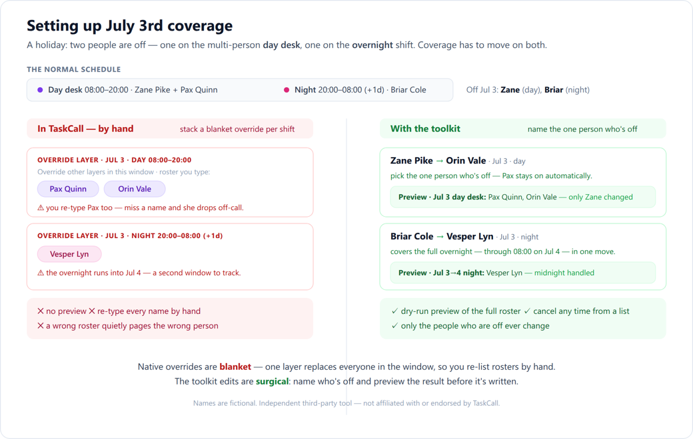
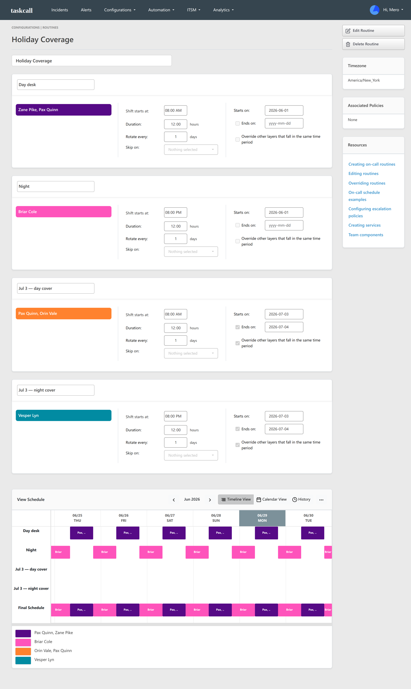
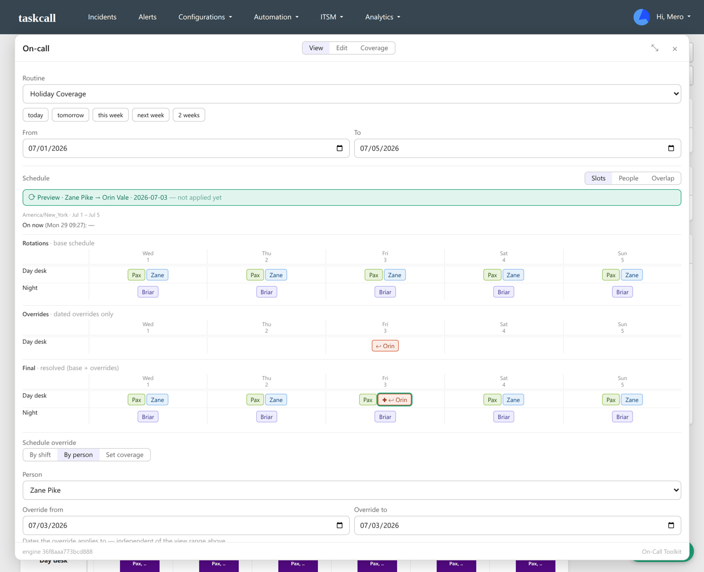
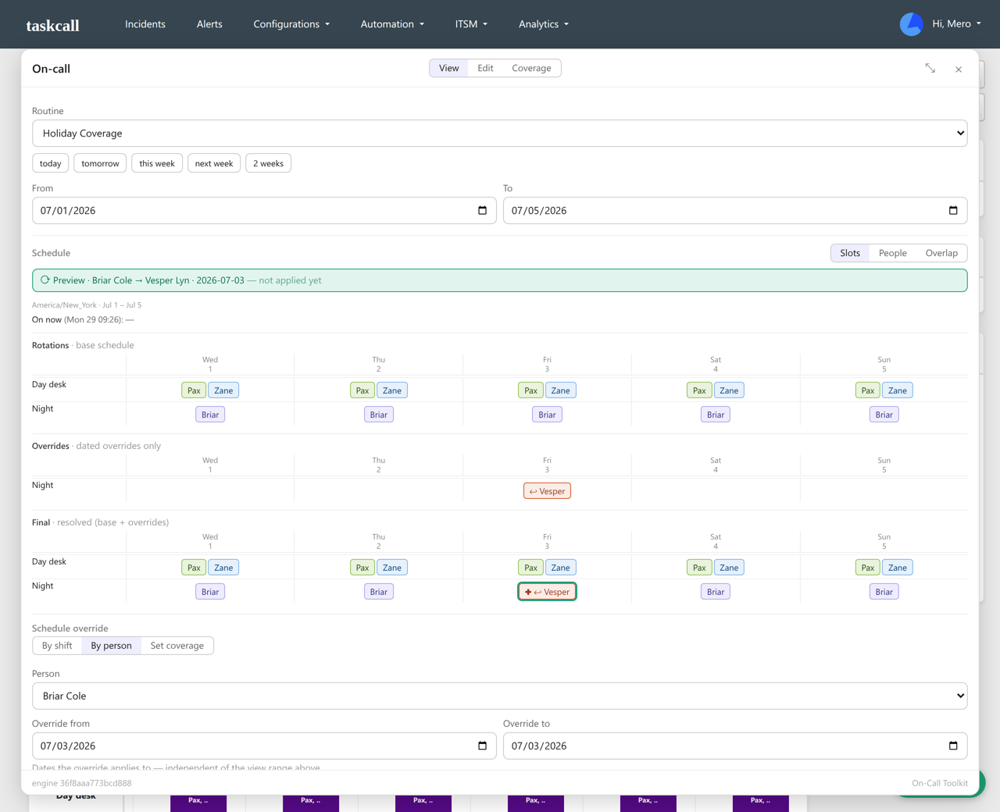

# A real example: covering a holiday

This walks through covering a holiday when a couple of people are off: where TaskCall's built-in overrides get tedious, and how this toolkit helps.

> A quick vocabulary, if you're new to this: an **on-call routine** is a schedule of who gets paged when. It's made of **shifts** (recurring blocks, like a *day desk* from 08:00 to 20:00). An **override** is a one-off change for specific dates ("so-and-so is off Friday, someone else covers"): it's layered onto that same routine for just those dates, then expires. You don't create a separate routine to cover an absence, and the routine itself never changes.

## The setup

This is the team's normal, always-on routine, the one that runs every day. Nothing below creates a new routine; the holiday is handled entirely by a dated override on top of this same one.

A small team runs two back-to-back shifts that together cover the clock:

- **Day desk**, 08:00 to 20:00. Two people are on at once: **Zane Pike** and **Pax Quinn**.
- **Night**, 20:00 to 08:00. One person: **Briar Cole**. This shift is overnight, so it runs past midnight into the next morning.

Two more people, **Orin Vale** and **Vesper Lyn**, are around to cover when someone's out.

## What changes on July 3rd

It's the day before the 4th, and two people are off:

- **Zane** (day desk) is off, so **Orin** will cover the day.
- **Briar** (night) is off, so **Vesper** will cover the overnight into the 4th.

Pax is not off. She should stay on the day desk the whole time, and keeping her there is exactly what gets fiddly.

## In TaskCall today

TaskCall's overrides are *blanket*: an override is a new layer that replaces everyone on call during its window. To change who's on, you add an override layer and type the full roster for that window by hand, including the people who weren't going anywhere.

For July 3rd that means stacking two override layers:

The **Jul 3 day cover** layer lists **Pax Quinn and Orin Vale**. Because the layer replaces the whole window, you have to include Pax even though she isn't off; anyone you leave out simply isn't on call that day, with no warning. The **Jul 3 night cover** layer lists **Vesper Lyn**, and since that shift is the overnight one, it's a second window to get right.

The bigger catch is there's no preview of the resulting schedule before you save, so a missed name isn't caught until someone isn't paged. You can give each layer an "Ends on" date so it stops applying by itself once the holiday passes, so cleanup isn't the problem; the by-hand roster and the missing preview are.

## With the toolkit

Instead of re-typing rosters, you name the one person who's off and who covers them. The toolkit reads the real schedule, changes only that person, and shows the result before anything is written.

Here's the **day** change, Zane to Orin for July 3rd:

The **Final** row (resolved base plus overrides) shows the day desk on the 3rd as **Pax Quinn and Orin Vale**. Pax stayed on automatically; you never touched her. The banner reads *"not applied yet"*, because this is a dry run that shows exactly what will happen first.

The **night** change is the same one move, Briar to Vesper for July 3rd:

The Final row now shows **Vesper** on the night that starts on the 3rd, which runs through to 08:00 on the 4th. The day desk is left alone. Like a dated native override, these stop applying on their own after the 3rd; unlike it, each one previews first and shows up in a list you can cancel in a click.

## The difference

| | TaskCall, by hand | With the toolkit |
|---|---|---|
| To change one person | Re-type the whole roster for the window | Name the person and their cover |
| People who weren't off | You re-list them; miss one and they drop | Stay on, untouched |
| The overnight shift | A second window to track across midnight | Named once, covered through to morning |
| Before you save | No preview | A dry run shows the full resulting roster |
| Afterward | End-date it (it expires on its own) | Same: dated and expiring, plus listed for one-click cancel |

Both kinds of override expire on their own once you date them, so the real difference is the re-typing and the missing preview, not cleanup. Same result, with far less room to quietly page the wrong person.

---

*Names and the routine above are fictional, set up purely for this example. Independent third-party tool, not affiliated with, endorsed by, or sponsored by TaskCall.*
